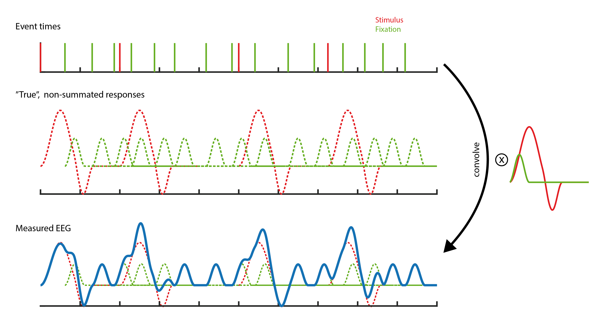
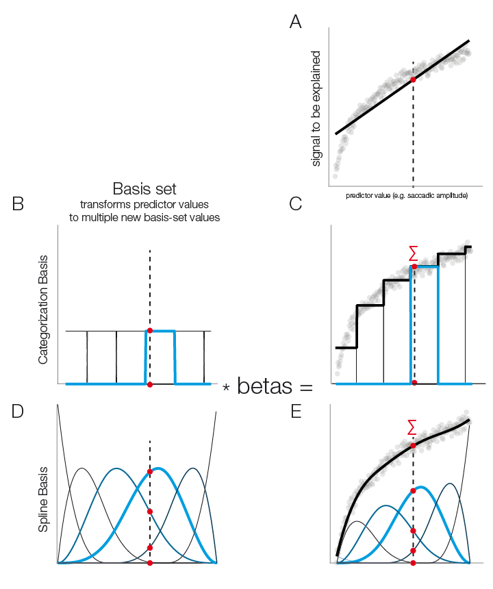

Theoretical Background
==================
We recommend the *unfold* toolbox paper (`Ehinger & Dimigen 2018 <XXX>`,b) for an introduction to linear modeling in ERP analyses. The second part explicitly discusses deconvolution. This overview will give you the gist on these topics.

Introduction to linear modeling
----------------------------------
Linear modeling tries to explain the data (ERPs / EEG signals) as a sum of some predictors / independent variables. In M/EEG analysis usually one GLM is fitted separately for each electrode and time-point. It can be formally stated as

.. math::
  y = x_1*\beta_1 + x_2*\beta_2 + ... + x_n*\beta_n + e = X\beta +e

because  :math:`\beta` is unknown one has to estimate it, usually using:

.. math::
  \beta = X^{-1}y

The choice of predictors (:math:`x_1,x_n...`) is up to the analyst of the signal. In order to understand how to use the toolbox it is helpful to understand the designmatrix :math:`X`. This designmatrix has multiple columns, each representing a predictor. Each row is one repetition, usually in EEG, one trial. If the predictor is a categorical one, some kind of encoding has to be used (reference/effects are currently supported). This encoding translates for example a two condition predictor 'face' vs 'house' in one predictor called the intercept, which in reference coding represents the reference-category (we use 'face') and the other predictor represents the difference of 'face' and 'house', because everything 'face' can explain, has already been soaked up by the first predictor.

Why deconvolution?
--------------------
It is standard practice in M/EEG research to separate events in time, so that no overlap occurs. But in some cases this is not possible. Especially in reading or free-viewing, that is experiments involving eye movements. Fixations occur on average every 250ms. Long lasting potentials like P300 or N400 occur around 400ms after stimulus onset. It is clear that in each fixation, the activity of the previous fixation is overlapping. Also even without long lasting potentials, baselines are influenced by the previous stimulus (e.g. Lütkenhof 2010).

If the overlap for two conditions is exactly identical, the differences between the conditions are unaffected. But often this is not the case. For example fixation durations are correlated with many cognitive variables of interest. And if fixation durations differ between two conditions, bias can arise as the overlap of the potentials is different. This can hide as well as generate differences between conditions. One example is given in the following plot.

.. image:: ../../docs/tutorials/deconvolutionProblem.png

In this example, a difference between conditions A & B arises only due to their different distances to the subsequent event (shown as histograms in B). This difference completely vanishes if we use deconvolution.

How does deconvolution work?
----------------------------
Deconvolution tries to disentangle the signal. This is possible as the overlap is a bit different in each trial. Thus an algorithm can try to disentangle the process. The simplest way to do this is linear deconvolution, assuming that the signals of two events are linearly added. This has support in physiology: voltages are added linearly, that is, if two sources are active at the same time their voltage potentials can be summed. Linear deconvolution assumes that the first event does not influence the processing of the second event, an assumption that is most certainly wrong in the general case. But, importantly, one has to deal with this in a more generic ERP analysis as well. At least with deconvolution, some part of the overlap can be corrected for.

To understand deconvolution it is useful to first have a look at **convolution**.

Here two types of events are visible, red **stimuli** events and green **saccade** events. If one where to measure a single event in isolation, one would find the kernels depicted on the right. This is the response we usually are interested in. If we add this kernel at all respective places in the timeseries, we receive the second row. If we now add up the signals at each point in time, we receive the measured EEG. The task of deconvolution is to find out the kernel without knowing its shape. The only information we have is the measured EEG and the times when events occurred.

**Deconvolution**

The key insight in how deconvolution using LMs works is, that each sample of the timeseries can be thought of a linear summation of kernel responses with respectively different times in the kernels. As an example take a voltage at sample $n$. Assume that there are three previous events that we think could overlap to explain this voltage. This voltage is the result of, for example, a summation of kernel A at t==5 and kernel B t==2 and kernel B at t==7. Yet another sample $n_2$ might have only two events **but with slightly different kernel-timings** e.g. A at t==1 and B at *t==2*. We now have an example where B is at t==2, but A is at t==1 once and at t==5 the other time. This allows us to disentangle the signal.

In practice this works by timeexpanding our designmatrix. For the following example, the designmatrix was a design with two columns/predictors. One for the stimulus-kernel and one for the saccade-kernel.

.. image:: ../../docs/tutorials/deconvolutionExplanation.png
  :width: 60%
Time is on the x-axis. A beta-parameter needs to be estimated for each row with blocks of the designmatrix (the red/green blocks). The sample (blue) is assumed to be the linear sum of (in the dashed example) three events with different betas associated (they are different also for the same event *green*, because the distance to the event is different). After constructing this matrix and expanding the designmatrix in time, we can again invert it and solve for all unknown betas. It might be interesting to note that the influence of an event can also be modeled in the past. For example motor potentials are usually visible before the keypress. In practice one defines a window around each event, e.g. [-0.5 to 1s] and the toolbox takes care of the rest.

Introduction to additive/spline linear modeling
------------------------------------------------
Sometimes relations between predictors and lets say P100 are not linear. For example saccadic amplitude has a logarithmic relationship. If this relationship is known, one can simply transform the predictor (log transform in this case) and then perform a linear fit. But in many cases either the relationship is not known, or it is not a simple function.

In panel A of this figure we see that a linear function does not fit well our logarithmical relation.

In the following we see the case additive linear modeling allows to use flexible basis functions to model those non-linearities. A simple basis function is the boxcar function and it has a simple analogy: It is equivalent to splitting a continuous predictor in multiple categorical ones.

In Panel B & C  we split the continuous predictor into six categorical predictors. In the modelfit (right plot) one can clearly see the step-function of this approach. In Panel D & E a more sensible approach is show: smooth borders. This can be achieved by using spline-basis functions instead of boxcars

In order to get from the basisfunctions (left) to the function fit (right), each basis-function is multiplied by a fitted beta-coefficient value and then summed. These weighted basis-functions are in addition plotted in the right plot. It is important to note that the number of basis-functions is important to prevent over or underfitting. In the unfold toolbox one has to set the number of splines by hand. Nested crossvalidation to get a good estimate of the number of splines to use is certainly possible but computationally extremely expensive. In the field of additive modeling this issue is so far an unresolved problem.

The connection of (formal) convolution and timeexpansion
-----------------------------------------------------------
In linear deconvolution, we make use of the knowledge that each observed sample of the continuous EEG sample can be described as the linear sum of (possibly) several overlapping event-related EEG responses. Depending on the latencies of the neighboring events, these overlapping responses occur at different times relative to the current event instance. In the following we will assume two events, A & B. The observed continuous EEG at time point t can be described as follows: 
$$EEG(t)=∑_(i=1)^(n_A)ERP_A(t-eventOnsetA_i)+ ∑_(i=1)^(n_B)ERP_B(t-eventOnsetB_i)$$
With $i$ an instance of an event.

The (unknown) function $EEG_A (t-eventOnsetA_i )$  can be thought of as the “true” ERP activity at the continuous EEG time point t. Because instances of events occur at different time points, they are centered by the $t-eventOnsetA_i$ term, we refer to this centered time (the distance to the event) as local time $\tau$. 

This is indead a classical convolution. If we replace the event onsets by a vector $g$ with zeros everywhere and ones  at the samples of event onset, we get:
$$EEG(t)=g_A*ERP_A+g_B*ERP_B$$
A sum of convolutions. This is the process we need to reverse, that is, we need to estimate $ERP_A$ and $ERP_B$ given $EEG(t)$ and $g$. 
